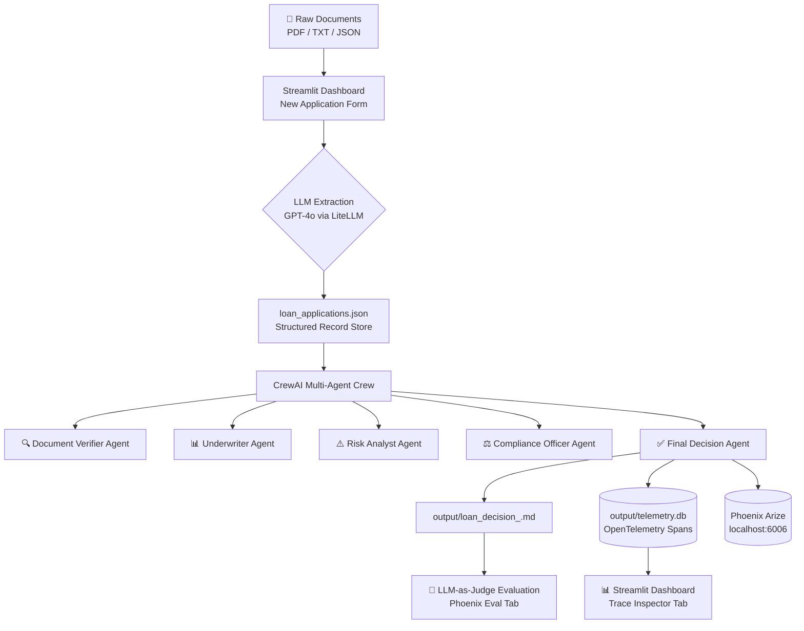

# 🏦 Loan Processing Agent — Agentic AI System

A production-grade, end-to-end **multi-agent AI loan processing system** built with [CrewAI](https://crewai.com), featuring an observability dashboard, document intake via LLM extraction, Phoenix Arize tracing, and LLM-as-judge evaluation.

> **Built for:** Teaching Agentic AI in BFSI (Banking, Financial Services & Insurance) contexts.

---

## 🏗️ Architecture Overview



---

## 📁 Project Structure

```
loan_processing_crew/
├── src/loan_processing_crew/
│   ├── config/
│   │   ├── agents.yaml          # Agent roles, goals, backstories
│   │   └── tasks.yaml           # Task definitions and expected outputs
│   ├── tools/                   # Custom CrewAI tools
│   ├── crew.py                  # Crew assembly and wiring
│   ├── main.py                  # Entry point — processes all/one application
│   ├── dashboard.py             # Streamlit observability dashboard (4 tabs)
│   └── phoenix_eval.py          # Phoenix Arize tracing + LLM-as-judge evals
├── synthetic_data/
│   └── loan_applications.json   # 9 test scenarios + any new intake records
├── raw_documents/
│   └── <LOAN-ID>/               # Uploaded documents per application
│       ├── bank_statement.pdf
│       ├── driver_license.pdf
│       ├── employment_letter.pdf
│       ├── paystub_Jan/Feb/Mar.pdf
│       ├── w2_2024.pdf
│       └── w2_2025.pdf
├── output/
│   ├── loan_decision_<ID>.md    # Individual decision reports
│   ├── loan_decision.md         # Consolidated report (all applications)
│   ├── telemetry.db             # OTel spans (SQLite)
│   └── phoenix_evals.db         # LLM evaluation results (SQLite)
├── tests/
│   └── test_loan_processing.py  # 9 pytest scenarios
├── .github/workflows/ci.yml     # GitHub Actions CI/CD pipeline
├── pyproject.toml               # Dependencies (uv)
├── .env                         # OPENAI_API_KEY
└── notes.txt                    # Prompt history used to build this project
```

---

## ✅ Prerequisites

| Requirement | Version |
|---|---|
| Python | ≥ 3.10, < 3.14 |
| uv (package manager) | latest |
| OpenAI API Key | Required |
| Git | Any recent version |

---

## 🚀 Quick Start

### 1. Clone the repository

```bash
git clone <your-repo-url>
cd loan_processing_crew
```

### 2. Install uv (if not already installed)

```bash
pip install uv
```

### 3. Install all dependencies

```bash
uv sync
```

### 4. Configure your API key

Create a `.env` file in the project root (or edit the existing one):

```bash
OPENAI_API_KEY=sk-your-openai-api-key-here
```

---

## ▶️ Execution Steps

### Option A — Process All Loan Applications (Batch Mode)

Runs all 9 synthetic test scenarios from `synthetic_data/loan_applications.json`:

```bash
uv run loan_processing_crew
```

Or equivalently:

```bash
uv run python src/loan_processing_crew/main.py
```

**Output:** Individual decision reports saved to `output/loan_decision_<ID>.md` and a consolidated `output/loan_decision.md`.

---

### Option B — Process a Single Application

```bash
uv run python src/loan_processing_crew/main.py LOAN-2026-00142
```

Replace `LOAN-2026-00142` with any application ID from `loan_applications.json`.

---

### Option C — Launch the Observability Dashboard

```bash
uv run streamlit run src/loan_processing_crew/dashboard.py
```

Open **[http://localhost:8501](http://localhost:8501)** in your browser.

The dashboard has **4 tabs**:

| Tab | Description |
|---|---|
| 📊 Executive Summary | KPI cards: token costs, avg latency, error rate, decision distribution charts |
| 🔍 Trace Inspector & Compliance | Gantt chart of agent task timeline, compliance checklist, raw OTel span tree |
| 📝 New Application Form | Upload documents → LLM extracts data → Review form → Submit → Trigger crew review |
| 🧪 Evaluation | Run LLM-as-judge evals, score heatmap, pass/fail breakdown, detailed rubric results |

---

### Option D — Launch Phoenix Arize Trace UI

Phoenix auto-starts when the crew runs (`main.py`). To start the trace UI independently and keep it running in the terminal:

```bash
uv run phoenix serve
```

Open **[http://localhost:6006](http://localhost:6006)** to see:
- Full span waterfall per loan application
- Token usage and latency per agent/task
- Automatic CrewAI instrumentation traces

---

### Option E — Run LLM Evaluations (Standalone)

Evaluate all processed applications using GPT-4o-mini as a judge:

```bash
uv run python -c "
from loan_processing_crew.phoenix_eval import run_loan_evaluations
results = run_loan_evaluations()
print(results[['application_id','rubric_name','score','label']].to_string())
"
```

Or use the **🧪 Evaluation** tab in the Streamlit dashboard.

---

### Option F — Run Tests

```bash
uv run pytest tests/ -v
```

Or run a specific test scenario:

```bash
uv run pytest tests/test_loan_processing.py::test_normal_approval -v
```

---

### Option G — Run via Docker

Build the image and run the application container injecting environment variables dynamically via `--env-file`:

1. **Build the Docker Image:**

   ```bash
   docker build -t loan-processing-crew .
   ```

2. **Run Container with Environment File:**

   ```bash
   docker run -p 8501:8501 --env-file .env loan-processing-crew
   ```

   > **Note:** If port `8501` is already occupied on your host system, map to another port (e.g. `-p 8502:8501`):
   > ```bash
   > docker run -p 8502:8501 --env-file .env loan-processing-crew
   > ```


---

## 📝 New Application Intake Workflow

The **📝 New Application Form** tab enables a complete document-to-decision pipeline:

1. **Upload documents** — Select multiple PDFs (bank statements, pay stubs, W-2, driver's license, employment letter)
2. **Extract data** — Click **🔍 Extract Data from Uploaded Documents**. The system:
   - Saves files to `raw_documents/LOAN-TEMP-<timestamp>/`
   - Parses PDF text using `pypdf`
   - Calls `gpt-4o` via `litellm` to extract structured loan data
   - Renames folder to `raw_documents/LOAN-<APPLICANT_NAME>-<TIMESTAMP>/`
   - Pre-populates the form with extracted values
3. **Review & edit** — All fields are editable before submission
4. **Submit** — Appends record to `synthetic_data/loan_applications.json`
5. **Process** — Click **🚀 Trigger Agent Processing Flow** to run the crew review
6. **Inspect results** — Switch to the **🔍 Trace Inspector** or **🧪 Evaluation** tabs

---

## 🤖 Agents

| Agent | Role | Key Responsibility |
|---|---|---|
| Document Verifier | Checks document completeness | Validates ID, income docs, bank statements |
| Underwriter | Assesses creditworthiness | Calculates DTI, evaluates credit score |
| Risk Analyst | Identifies risk signals | Flags fraud patterns, financial red flags |
| Compliance Officer | Ensures regulatory compliance | ECOA, Fair Housing Act, AML checks |
| Final Decision Maker | Issues loan decision | Synthesizes all inputs → APPROVED / REJECTED / ESCALATE |

---

## 🧪 Test Scenarios

The 9 synthetic test scenarios in `loan_applications.json` cover:

| ID | Scenario |
|---|---|
| `LOAN-2026-HAPPY` | ✅ Normal approval — good credit, stable income |
| `LOAN-2026-00142` | ✅ Standard approval — Sarah J. Mitchell |
| `LOAN-2026-BAD-CREDIT` | ❌ Rejection — poor credit history |
| `LOAN-2026-DTI-LIMIT` | ⚠️ High debt-to-income ratio boundary |
| `LOAN-2026-FRAUD-RISK` | 🚨 Fraudulent income/document signals |
| `LOAN-2026-INCOMPLETE` | 📭 Missing required documents |
| `LOAN-2026-INCONSISTENT` | ⚡ Income inconsistency across documents |
| `LOAN-2026-ESCALATION` | 🔼 Manual review escalation required |
| `LOAN-2026-UNDERAGE` | 🚫 Underage applicant edge case |

---

## 🔭 Observability Stack

| Layer | Technology | Purpose |
|---|---|---|
| Span collection | OpenTelemetry SDK | Captures every agent, task, and tool call |
| Local storage | SQLite (`telemetry.db`) | Persistent span store for the dashboard |
| Trace UI | Phoenix Arize (`localhost:6006`) | Visual span waterfall, token usage |
| Auto-instrumentation | `openinference-instrumentation-crewai` | Zero-code CrewAI span capture |
| Evaluation | LiteLLM + GPT-4o-mini | LLM-as-judge scoring across 4 rubrics |
| Eval storage | SQLite (`phoenix_evals.db`) | Persistent evaluation results |

### Evaluation Rubrics

| Rubric | What is checked |
|---|---|
| `decision_correctness` | Is the APPROVED/REJECTED/ESCALATE decision consistent with the applicant's financials? |
| `compliance_completeness` | Were ECOA, Fair Housing Act, and AML requirements cited? |
| `document_verification` | Were all submitted documents (ID, pay stubs, W-2, bank statements) explicitly reviewed? |
| `risk_flag_detection` | Were fraud signals, high DTI, late payments, or bankruptcies correctly flagged? |

---

## 🔧 Key Files Reference

| File | Purpose |
|---|---|
| `src/.../agents.yaml` | Define agent roles, goals, and backstories |
| `src/.../tasks.yaml` | Define task descriptions and expected outputs |
| `src/.../crew.py` | Wire agents + tasks + tools into the CrewAI crew |
| `src/.../main.py` | Entry point: loads applications, runs crew, writes reports |
| `src/.../dashboard.py` | Streamlit 4-tab observability + intake dashboard |
| `src/.../phoenix_eval.py` | Phoenix tracing init + LLM-as-judge evaluation engine |
| `synthetic_data/loan_applications.json` | Application records (source of truth) |
| `.env` | Environment variables (API keys) |
| `notes.txt` | Full prompt history used to build this project |

---

## 🔁 CI/CD Pipeline

GitHub Actions runs automatically on every push and pull request to `main`:

```
Push / PR to main
      │
      ▼
Setup Python 3.11 + uv
      │
      ▼
uv sync (install dependencies)
      │
      ▼
uv run pytest tests/ -v --tb=short
      │
      ▼
Upload test results as artifacts
```

**Required GitHub Secret:** `OPENAI_API_KEY`

---

## 📦 Dependencies

Key packages (managed via `uv` / `pyproject.toml`):

| Package | Purpose |
|---|---|
| `crewai[tools]` | Multi-agent orchestration framework |
| `streamlit` | Observability dashboard UI |
| `plotly` | Interactive charts (Gantt, heatmap, bar) |
| `pandas` | Data manipulation |
| `pypdf` | PDF text extraction |
| `litellm` | Unified LLM API (GPT-4o, GPT-4o-mini) |
| `arize-phoenix` | Trace storage + evaluation UI |
| `openinference-instrumentation-crewai` | Auto-instrument CrewAI spans |
| `opentelemetry-sdk` | OTel span capture |
| `fpdf2` | Generate synthetic PDF documents |

---

## 🌿 Git Branch

This project is maintained on the `Opentelemetry` branch:

```bash
git checkout Opentelemetry
git push -u origin Opentelemetry
```

---

## 📚 Resources

- [CrewAI Documentation](https://docs.crewai.com)
- [Phoenix Arize Documentation](https://docs.arize.com/phoenix)
- [OpenTelemetry Python SDK](https://opentelemetry.io/docs/languages/python/)
- [LiteLLM Documentation](https://docs.litellm.ai)
- [Streamlit Documentation](https://docs.streamlit.io)
